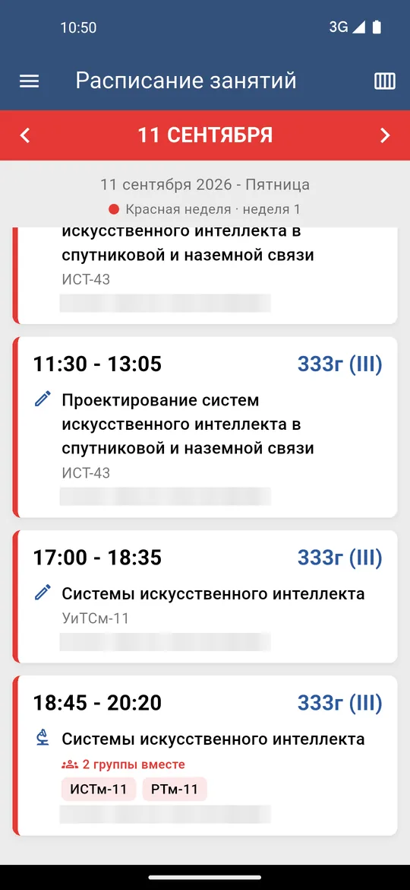
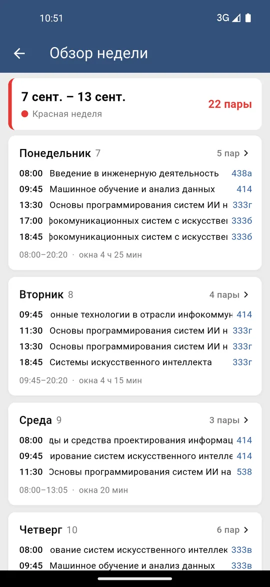
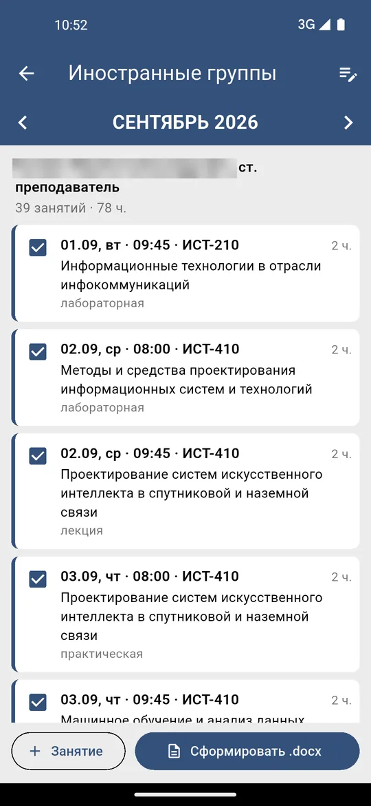
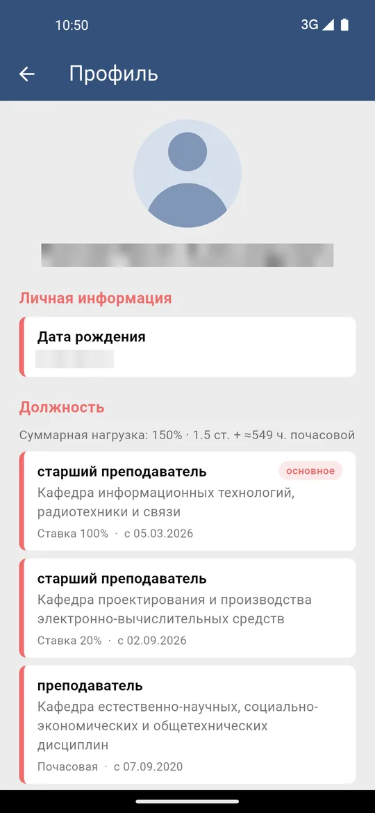
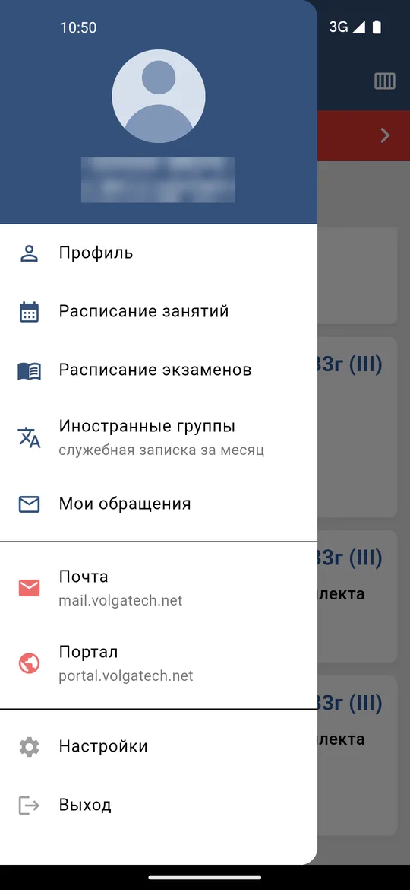

# Волгатех.Коллектив

[](https://github.com/nikita-konkin/volgatech.corp/actions/workflows/ci.yml)
[](https://github.com/nikita-konkin/volgatech.corp/releases/latest)

A fast, native rewrite of the ПГТУ / VolgaTech staff cabinet app («Личный кабинет
работника»), built with **Flutter** for Android and iOS. Client-only — it talks to
the existing `api.volgatech.net` backend and does not change it.

The Flutter app lives in [`app/`](app/).

| Расписание | Обзор недели | Иностранные группы | Профиль | Меню |
|:-:|:-:|:-:|:-:|:-:|
|  |  |  |  |  |

## 📥 Download

Grab the latest signed-for-testing APK from the
**[Releases page](https://github.com/nikita-konkin/volgatech.corp/releases/latest)**.
For a 64-bit phone (most modern devices) pick `app-arm64-v8a-release.apk`.

## Features

- **Login** with JWT + auto-refresh; tokens in the OS keystore, the password is
  never stored.
- **Расписание занятий** — day view, swipe between days, offline cache, a
  week-type accent colour (red for week 1, blue for week 2), and an **«Обзор
  недели»** overview (Пн–Вс, lessons per day, gaps «окна», total pairs, tap a
  day to jump).
- **Расписание экзаменов** — study-year picker, grouped by date, offline cache.
- **Профиль** — photo, birthday, and every appointment (main department first)
  with its **ставка / почасовая** load, department and start date, plus a
  combined-load line and work experience.
- **Иностранные группы** — the monthly «служебная записка» about classes taught
  to foreign students (groups with a 3-digit number, e.g. ИСТ-110), built from
  your schedule and shared as a .docx in the portal's own template.
- **Настройки** — theme (system / light / dark) and an optional
  fingerprint / PIN **app-lock**.
- **Почта** and **Портал** — OWA mail and the corporate portal open **in-app**
  (WebView), keeping only the site session cookie, never the password.
- Friendly Russian error/empty/retry states; honours OS font scaling.

## What's new — v0.4.1

- **Настройки** show the installed version (was stuck at v0.1.0).
- **Dark theme** — buttons and checkboxes are a lighter blue, so «Сформировать
  .docx» no longer looks disabled.

## What's new — v0.4.0

- **Служебная записка по иностранным группам** — Menu → «Иностранные группы»
  lists the month's classes with foreign-student groups (3-digit numbers such as
  ИСТ-110…ИСТ-410), one row per class at 2 h, and shares the memo as a .docx
  filled into the portal's template (total in the last cell, e.g. «2/78»).
  Untick classes, add ones by hand, shorten subject names; the letterhead and
  signature fields are filled once and remembered. During the first ten days the
  previous month is preselected.
- **Faster, works offline** — the schedule shows the saved copy instantly and
  refreshes in the background; the next week is prefetched; loading
  placeholders in the week overview; the profile photo is cached.
- **Fewer surprise logouts** — a network hiccup while renewing the session no
  longer signs you out; when the session really expires you get a notice and
  land on the login screen.

## What's new — v0.3.2

- **Shared lessons** — when two groups are taught together in the same room at
  the same time, the schedule now shows **one card** with a «N групп вместе»
  badge and the group chips (instead of duplicate cards); the week overview
  merges those rows and counts distinct slots.
- **Classical lesson icons** — Лекции = book, Практические = pencil,
  Лабораторные = microscope.

## What's new — v0.3.1

- **Login accepts an e-mail** — typing your full corporate address
  (`KonkinNA@volgatech.net`) now logs in: it's reduced to the bare account name
  (`konkinna`), trimmed and lowercased.

## What's new — v0.3.0

- **«Обзор недели» — swipe between weeks** (horizontal drag, like the day view),
  with a loading bar while the next week loads.
- **Auto-scrolling lesson names** — long subject titles that don't fit now gently
  scroll instead of being cut off with «…».
- **«Профиль» in the menu** — an explicit drawer entry (the header photo was
  tappable but easy to miss).
- **Почасовая appointments** show an approximate annual load («≈N ч.») alongside
  the ставка rows and the combined-load line.

## What's new — v0.2.0

- **«Обзор недели»** — a whole-week schedule overview off the Расписание screen:
  Пн–Вс day cards, lessons per day, first–last span, gaps («окна»), total pairs,
  the week colour, and tap-a-day to jump. Pure aggregation over the already-loaded
  week — no extra network calls.
- **Профиль** enriched from the real `GetInfo` data: birthday, every appointment
  ranked with the main department first (+ «основное» badge), each with its rate
  and start date, a **ставка vs почасовая** split with a «Суммарная нагрузка»
  line, and corrected Russian plurals for стаж.
- **iOS** — the build is now verified on every push by a macOS CI job
  (`flutter build ios --no-codesign`); a signed release (device / TestFlight /
  App Store) is documented in [docs/IOS_RELEASE.md](docs/IOS_RELEASE.md).
- More unit tests (schedule week-summary, profile parsing, RU pluralisation).

## What's new — v0.1.0

- First public build.
- In-app **Почта** and **Портал** (WebView) replacing the old link-outs.
- App identity: name **«Волгатех.Коллектив»**, icon = cleaned official ВОЛГАТЕХ logo.
- Biometric / PIN **app-lock** (opt-in).
- Schedule **week-type colours** + swipe-between-days + skeleton loader.
- Fixes: release builds now have network access; schedule day no longer shifts
  by a day across time zones.
- 18 unit tests; GitHub Actions CI/CD.

## Build

```bash
cd app
flutter pub get
flutter analyze
flutter test
flutter build apk --release --split-per-abi   # Android: per-ABI APKs (arm64 ≈ 20 MB)
flutter build ios --release --no-codesign      # iOS: unsigned build (needs macOS + Xcode)
```

Requirements: Flutter **stable**, JDK 17, Android SDK (compileSdk 36). minSdk is
24 (Android 7.0). For iOS: macOS with **full Xcode** + CocoaPods; deployment
target is iOS 15.0. A **signed** iOS build (device install / TestFlight / App
Store) needs an Apple Developer account — see **[docs/IOS_RELEASE.md](docs/IOS_RELEASE.md)**.

App icons are generated from `app/assets/icon/` with:

```bash
cd app && dart run flutter_launcher_icons
```

## CI/CD

GitHub Actions (Flutter **stable** channel):

- [`ci.yml`](.github/workflows/ci.yml) — on every push/PR to `main`: a Linux job
  runs `flutter analyze` + `flutter test` and builds the release APKs, and a
  macOS job builds the app for **iOS** (`--no-codesign`); both upload their output
  as workflow artifacts.
- [`release.yml`](.github/workflows/release.yml) — on a `v*` tag: builds the
  per-ABI release APKs and attaches them to a GitHub Release. (A signed iOS
  release needs an Apple Developer account — see [docs/IOS_RELEASE.md](docs/IOS_RELEASE.md).)

Cut a release:

```bash
git tag v0.2.0 && git push origin v0.2.0
```

## Roadmap

See [IMPROVEMENTS.md](IMPROVEMENTS.md).
