# Волгатех.Коллектив

[](https://github.com/nikita-konkin/volgatech.corp/actions/workflows/ci.yml)
[](https://github.com/nikita-konkin/volgatech.corp/releases/latest)

Быстрое нативное приложение «Личный кабинет работника» ПГТУ / Волгатех, заново
написанное на **Flutter** для Android, iOS и браузера (на iPhone или
компьютере).
Только клиент: работает с уже существующим сервером `api.volgatech.net` и ничего
в нём не меняет.

Исходный код — на [GitHub](https://github.com/nikita-konkin/volgatech.corp)
(приложение — в папке
[`app/`](https://github.com/nikita-konkin/volgatech.corp/tree/main/app)); на
[GitVerse](https://gitverse.ru/nikita-konkin/volgatech.corp) — собранная
веб-версия и копии релизов. In English:
[README.md](https://github.com/nikita-konkin/volgatech.corp/blob/main/README.md).

<p align="center">
  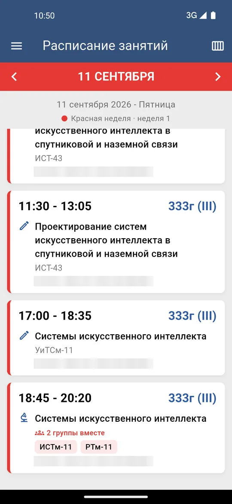
  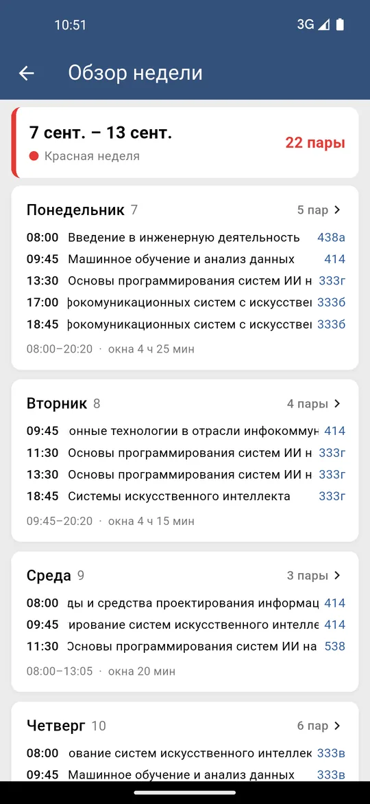
  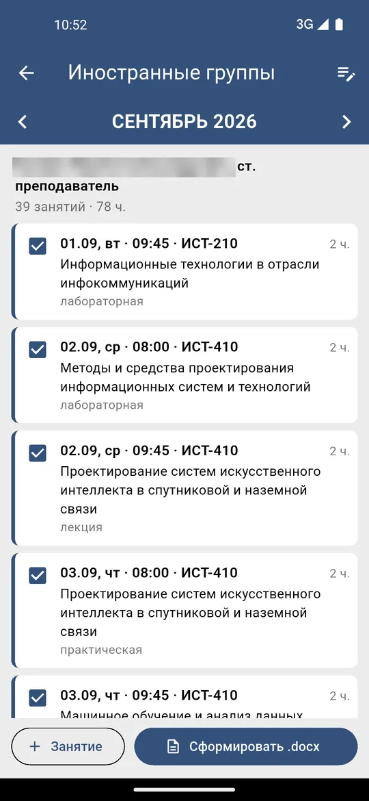
  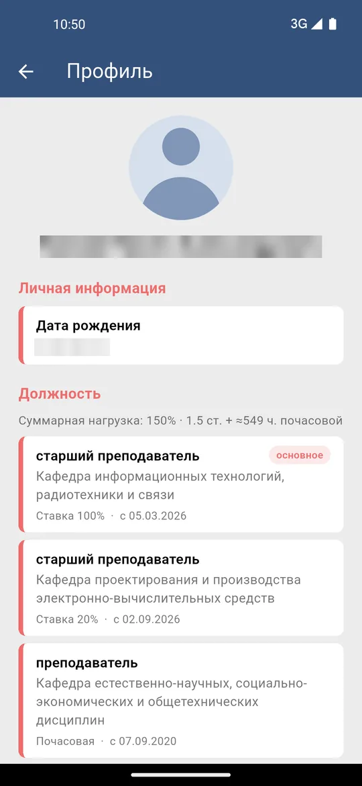
  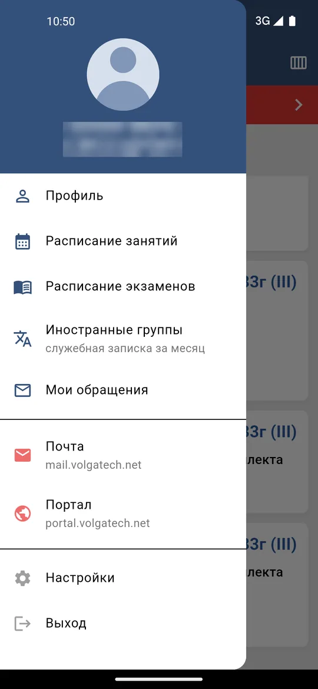
  <br><sub>Расписание · Обзор недели · Иностранные группы · Профиль · Меню</sub>
</p>

<p align="center">
  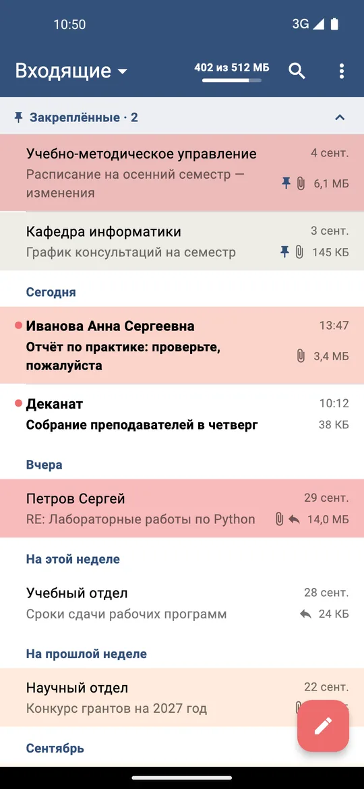
  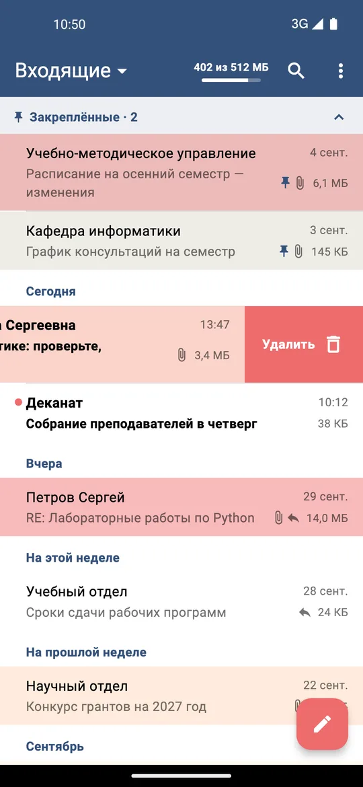
  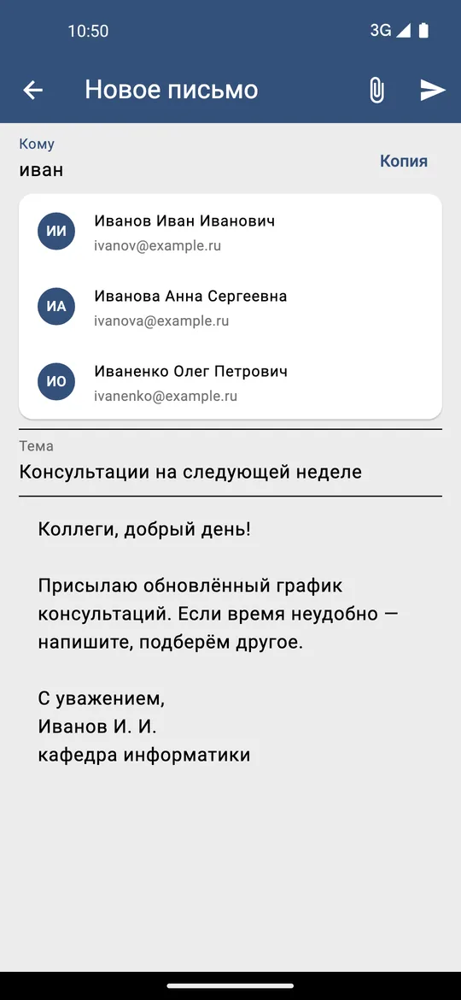
  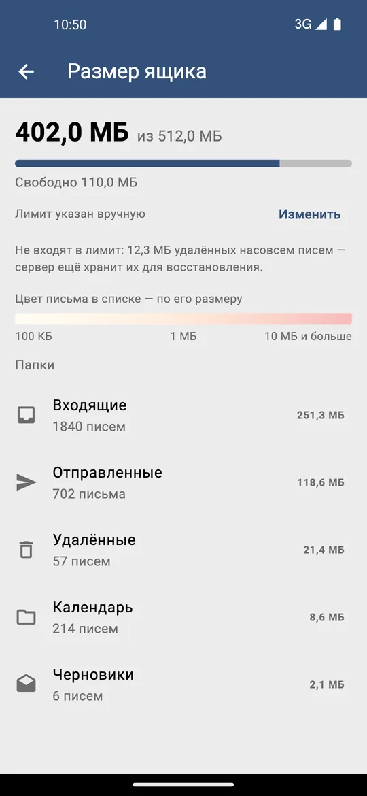
  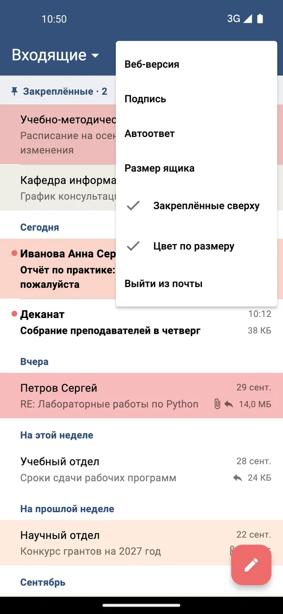
  <br><sub>Почта: Входящие · Удаление свайпом · Новое письмо · Размер ящика · Меню
  (данные для примера)</sub>
</p>

## 📥 Скачать

Последний APK — на **странице релизов**:
[GitHub](https://github.com/nikita-konkin/volgatech.corp/releases/latest) или
[GitVerse](https://gitverse.ru/nikita-konkin/volgatech.corp/releases) (копия).
В каждом релизе два набора одного и того же приложения; для 64-битного телефона
(почти все современные) берите вариант `arm64-v8a`:

| APK | «Почта» в приложении |
|---|---|
| `app-mail-arm64-v8a-release.apk` | **встроенный почтовый клиент** (с v0.5.0) |
| `app-arm64-v8a-release.apk` | веб-почта (OWA) внутри приложения, как раньше |

Подпись у обоих одна, поэтому любой ставится поверх другого. Начиная с v0.5.1
приложение само находит новые релизы и устанавливает их (см. ниже); с v0.5.0 и
более старых версий v0.5.1 нужно один раз поставить вручную.

> **Стоит v0.4.1 или старше?** Перед установкой v0.4.2 один раз удалите старое
> приложение: прежние сборки каждый раз подписывались новым ключом. Начиная с
> v0.4.2 новые версии ставятся поверх старой.

## 🌐 В браузере: iPhone и компьютер

То же приложение работает в браузере — на iPhone, для которого нет версии в App
Store (для неё нужен платный аккаунт Apple Developer), и на любом компьютере:

**https://nikita-konkin.gitverse.site/volgatech-corp/**
(или копия: https://konkin-nikita.ru/volgatech.corp/)

### На iPhone

1. Откройте ссылку в Safari.
2. Нажмите **Поделиться** → **На экран «Домой»** → **Добавить**.
3. Запустите «Волгатех» с экрана «Домой» и войдите в нём: у приложения на
   экране «Домой» свои данные, отдельно от Safari.

Каждый экран подогнан под любой iPhone — от первого SE до 17 Pro Max,
вертикально и горизонтально.

### На компьютере

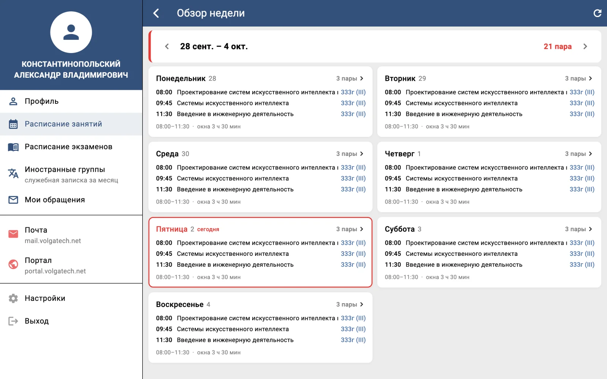

Откройте ссылку в Chrome, Edge, Firefox, Safari или Яндекс Браузере и войдите.
Chrome и Edge могут ещё установить его отдельным приложением (значок установки
справа в адресной строке). В окне шириной от 1000 пикселей:

- меню всегда открыто слева, а каждый экран остаётся таким, каким вы его
  оставили, — день, месяц, открытый обзор недели;
- занятия, экзамены и записка не растягиваются на всю ширину, а в обзоре
  недели дни стоят рядом;
- **←** и **→** листают день, неделю или месяц; в обзоре недели есть кнопки
  ‹ › для недели, а в расписании, экзаменах и записке — кнопка ⟳: потянуть
  список вниз, чтобы обновить, можно только пальцем.

В окне поуже — то же, что на телефоне, с меню за кнопкой ☰.

### В отличие от Android

Расписание, обзор недели, экзамены, профиль и записка по иностранным группам
работают, но:

- «Почта» открывает веб-почту в новой вкладке: почтовый сервер не принимает
  запросы с веб-страниц, поэтому встроенного клиента нет;
- нет блокировки по Face ID, отпечатку или PIN-коду;
- обновлять ничего не нужно: сайт пересобирается при каждом изменении
  приложения, а новая версия загружается при следующем запуске.

## Возможности

- **Вход** с JWT и автоматическим продлением сессии; токены — в защищённом
  хранилище ОС, пароль не сохраняется.
- **Расписание занятий** — по дням, переход между днями свайпом, работа без
  сети, цвет типа недели (красный — первая, синий — вторая) и **«Обзор
  недели»** (Пн–Вс, занятия по дням, «окна», всего пар, нажатие на день
  открывает его).
- **Расписание экзаменов** — выбор учебного года, группировка по датам, работа
  без сети.
- **Профиль** — фото, день рождения и все должности (основное место работы
  первым) с нагрузкой **ставка / почасовая**, подразделением и датой начала,
  плюс суммарная нагрузка и стаж.
- **Иностранные группы** — ежемесячная «служебная записка» о занятиях с
  иностранными студентами (группы с трёхзначным номером, например ИСТ-110):
  собирается из вашего расписания и отправляется как .docx по шаблону портала.
- **Настройки** — тема (системная / светлая / тёмная) и необязательная
  **блокировка** отпечатком пальца или PIN-кодом.
- **Обновления** — о новом релизе на GitHub сообщает баннер в приложении;
  «Обновить» скачивает нужный телефону APK, проверяет его и открывает
  установщик Android.
- **Почта** — в APK `app-mail-*` **встроенный клиент** университетского ящика
  Exchange (EWS): папки, поиск, закреплённые письма, вложения, ответы с
  подписью, подсказки из адресной книги, «Автоответ», размер ящика и счётчик
  непрочитанных. Пароль от почты хранится в защищённом хранилище ОС и
  удаляется по «Выйти из почты». В обычных APK, как раньше, внутри приложения
  открывается OWA.
- **Портал** — корпоративный портал открывается **внутри приложения**; хранится
  только cookie сессии сайта, пароль — никогда.
- Понятные сообщения об ошибках и пустых экранах с кнопкой «Повторить»;
  учитывается размер шрифта из настроек системы.

## Что нового — v0.5.1

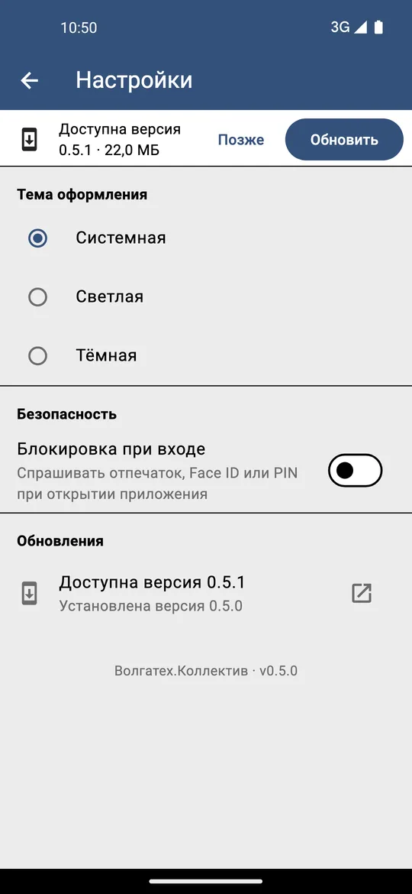

- **Обновления прямо из приложения** — когда на GitHub появляется новый релиз,
  поверх открытого экрана показывается баннер «Доступна версия X · N МБ»
  (проверка — при открытии приложения и возврате в него, не чаще раза в
  6 часов). «Обновить» скачивает APK для этого телефона — с почтовым клиентом
  или без, под его тип процессора, — сверяет размер и SHA-256, которые
  публикует GitHub, и открывает установщик Android. В первый раз Android
  попросит разрешить установку из Волгатех.Коллектив.
- «Позже» скрывает баннер для этой версии; в **Настройки → Обновления** она
  по-прежнему доступна, там же — проверка по запросу и ссылка на описание
  релиза.
- Android ставит обновление, только если оно подписано ключом самого
  приложения, так что подменить его чужим файлом нельзя.

<br clear="right">

## Что нового — v0.5.0

- **Встроенный почтовый клиент** — в новых APK `app-mail-*` «Почта»
  показывает университетский ящик в самом приложении, а не веб-страницу.
  Достаточно один раз ввести пароль от почты (он хранится в защищённом
  хранилище ОС).
  - **Список** — заголовки как в Outlook («Сегодня», «Вчера», «На этой
    неделе»…), точки у непрочитанных, закреплённые в Outlook письма сверху в
    сворачиваемой группе «Закреплённые», размер каждого письма и **цвет строки
    по размеру**: жёлтый от 100 КБ, оранжевый от 1 МБ, красный от 10 МБ.
    Обновление жестом вниз; поиск; в выборе папки — число непрочитанных.
  - **Свайп** влево — удалить («Отменить» в течение нескольких секунд),
    вправо — отметить прочитанным / непрочитанным.
  - **Чтение** — HTML-письма с заблокированными внешними картинками; вложения
    открываются, сохраняются на телефон или отправляются дальше; нажатие на
    строку отправителя показывает всех получателей; письмо можно перенести в
    другую папку.
  - **Написание** — ответ и пересылка; подсказки из адресной книги
    университета в «Кому» / «Копия»; вложения до 18 МБ; подпись (один раз
    импортируется из веб-почты); 5 секунд, чтобы отменить отправку;
    неотправленный текст сохраняется как черновик.
  - **Автоответ** — ответы на время отсутствия задаются на почтовом сервере,
    как в Outlook, поэтому работают и при выключенном телефоне.
  - **Размер ящика** — сколько занято, по папкам, с полосой заполнения рядом
    с «Входящими». Сервер не сообщает приложению лимит, поэтому его можно один
    раз ввести вручную из веб-почты («…достигнет 512.00 МБ»).
  - **Счётчик непрочитанных** на «Почте» и на кнопке ☰.
- Обычные APK, как и раньше, открывают веб-почту.

## Что нового — v0.4.2

- **Обновления ставятся поверх** — релизы теперь подписываются одним
  постоянным ключом. Раньше у каждой сборки был новый ключ, и Android отказывал
  в обновлении («Приложение не установлено: конфликт пакетов»). Один раз нужно
  удалить старое приложение; придётся заново войти и заполнить шапку записки.

## Что нового — v0.4.1

- **Настройки** показывают установленную версию (раньше всегда было v0.1.0).
- **Тёмная тема** — кнопки и флажки стали светлее, и «Сформировать .docx»
  больше не выглядит неактивной.

## Что нового — v0.4.0

- **Служебная записка по иностранным группам** — Меню → «Иностранные группы»
  показывает занятия месяца с группами иностранных студентов (трёхзначные
  номера, например ИСТ-110…ИСТ-410), по строке на занятие по 2 ч., и отправляет
  записку как .docx, заполненный по шаблону портала (итог — в последней
  ячейке, например «2/78»). Занятия можно снять, добавить вручную, сократить
  названия предметов; шапка и подпись заполняются один раз и запоминаются. В
  первые десять дней месяца сразу выбран предыдущий месяц.
- **Быстрее и без сети** — расписание сразу показывает сохранённую копию и
  обновляется в фоне; следующая неделя загружается заранее; в обзоре недели —
  заглушки на время загрузки; фото профиля кешируется.
- **Меньше неожиданных выходов** — сбой сети при продлении сессии больше не
  выкидывает из приложения; когда сессия действительно истекла, появляется
  сообщение и открывается экран входа.

## Что нового — v0.3.2

- **Совмещённые занятия** — когда две группы занимаются вместе в одной
  аудитории в одно время, в расписании теперь **одна карточка** с отметкой
  «N групп вместе» и списком групп (вместо повторяющихся карточек); обзор недели
  объединяет такие строки и считает разные пары.
- **Классические значки занятий** — Лекции — книга, Практические — карандаш,
  Лабораторные — микроскоп.

## Что нового — v0.3.1

- **Вход по e-mail** — можно ввести полный корпоративный адрес
  (`KonkinNA@volgatech.net`): он сводится к имени учётной записи (`konkinna`),
  без пробелов и в нижнем регистре.

## Что нового — v0.3.0

- **«Обзор недели» — переход между неделями свайпом** (по горизонтали, как в
  расписании по дням) и полоса загрузки, пока грузится следующая неделя.
- **Длинные названия прокручиваются** — названия предметов, которые не
  помещаются, плавно прокручиваются, а не обрезаются «…».
- **«Профиль» в меню** — отдельный пункт (фото в шапке меню тоже открывало
  профиль, но это легко было не заметить).
- **Почасовая нагрузка** показывается примерным годовым объёмом («≈N ч.»)
  рядом со ставками и в строке суммарной нагрузки.

## Что нового — v0.2.0

- **«Обзор недели»** — расписание на всю неделю с экрана «Расписание»: карточки
  Пн–Вс, занятия по дням, время с первой до последней пары, «окна», всего пар,
  цвет недели и переход к дню по нажатию. Считается по уже загруженной неделе —
  без лишних запросов к серверу.
- **Профиль** по настоящим данным `GetInfo`: день рождения, все должности
  (основное место первым, с отметкой «основное»), у каждой — ставка и дата
  начала, разделение **ставка / почасовая** со строкой «Суммарная нагрузка» и
  правильные окончания в стаже.
- **iOS** — сборка теперь проверяется при каждом изменении отдельной задачей
  CI на macOS (`flutter build ios --no-codesign`); подписанный релиз
  (на устройство / TestFlight / App Store) описан в
  [docs/IOS_RELEASE.md](https://github.com/nikita-konkin/volgatech.corp/blob/main/docs/IOS_RELEASE.md).
- Больше модульных тестов (сводка недели, разбор профиля, русские окончания).

## Что нового — v0.1.0

- Первая публичная сборка.
- **Почта** и **Портал** внутри приложения вместо внешних ссылок.
- Название **«Волгатех.Коллектив»**, значок — очищенный официальный логотип
  ВОЛГАТЕХ.
- **Блокировка** отпечатком пальца или PIN-кодом (по желанию).
- **Цвета типа недели** в расписании, переход между днями свайпом, заглушки
  при загрузке.
- Исправлено: у релизных сборок есть доступ к сети; день в расписании больше не
  сдвигается при смене часового пояса.
- 18 модульных тестов; CI/CD на GitHub Actions.

## Сборка

```bash
cd app
flutter pub get
flutter analyze
flutter test
flutter build apk --release --split-per-abi   # Android: APK под каждый тип процессора (arm64 ≈ 20 МБ)
flutter build apk --release --split-per-abi --dart-define=MAIL=true   # …со встроенным почтовым клиентом
flutter build apk --debug --dart-define=API=test   # с тестовым сервером test-api.volgatech.net, с пометкой «ТЕСТ»
flutter build ios --release --no-codesign      # iOS: сборка без подписи (нужны macOS и Xcode)
flutter build web --release --no-web-resources-cdn   # версия для браузера, в build/web
```

Чтобы увидеть веб-сборку так, как её показывает iPhone, раздайте `build/web` и
откройте её с отступами безопасной зоны телефона (сверху, справа, снизу, слева)
в адресе, например `http://localhost:8099/?insets=59,0,34,0` для iPhone 15 в
окне 393×852; `test/iphone_layout_test.dart` проверяет каждый экран на размерах
всех iPhone, а `test/desktop_layout_test.dart` — вид на компьютере в окнах от
800×600 до 1920×1080.

Требования: Flutter **stable**, JDK 17, Android SDK (compileSdk 36). minSdk —
24 (Android 7.0). Для iOS: macOS с **полным Xcode** и CocoaPods; минимальная
версия — iOS 15.0. Для **подписанной** сборки iOS (установка на устройство /
TestFlight / App Store) нужен аккаунт Apple Developer — см.
**[docs/IOS_RELEASE.md](https://github.com/nikita-konkin/volgatech.corp/blob/main/docs/IOS_RELEASE.md)**.

Значки приложения создаются из `app/assets/icon/` командой:

```bash
cd app && dart run flutter_launcher_icons
```

## CI/CD

GitHub Actions (канал Flutter **stable**):

- [`ci.yml`](https://github.com/nikita-konkin/volgatech.corp/blob/main/.github/workflows/ci.yml)
  — при каждом push / PR в `main`: задача на Linux запускает `flutter analyze` и
  `flutter test`, собирает релизные APK и веб-версию, а задача на macOS собирает
  приложение для **iOS** (`--no-codesign`); результаты сохраняются как
  артефакты.
- [`release.yml`](https://github.com/nikita-konkin/volgatech.corp/blob/main/.github/workflows/release.yml)
  — по тегу `v*`: дважды собирает релизные APK под каждый тип процессора
  (`app-mail-*` с `--dart-define=MAIL=true` и обычные `app-*`), подписанные
  ключом из секретов репозитория `ANDROID_KEYSTORE_BASE64` /
  `ANDROID_KEYSTORE_PASSWORD` (без них, или если у какого-то APK другой
  сертификат, публикация отменяется), и прикладывает их к релизу на GitHub.
  (Для подписанного релиза iOS нужен аккаунт Apple Developer — см.
  [docs/IOS_RELEASE.md](https://github.com/nikita-konkin/volgatech.corp/blob/main/docs/IOS_RELEASE.md).)
- [`web.yml`](https://github.com/nikita-konkin/volgatech.corp/blob/main/.github/workflows/web.yml)
  — при изменении `main`: собирает веб-версию и публикует её дважды:
  - **GitHub Pages** (Settings → Pages → Source: GitHub Actions) по адресу
    https://konkin-nikita.ru/volgatech.corp/;
  - **GitVerse Pages**: при заданных переменной `GITVERSE_REPO` = `владелец/репозиторий`
    и секрете `GITVERSE_TOKEN` сайт, этот README и скриншоты заменяют файлы в
    основной ветке того репозитория, и GitVerse публикует корень ветки по адресу
    https://nikita-konkin.gitverse.site/volgatech-corp/ (там: Настройки → Pages —
    включено, из ветки; включить можно, когда в репозитории есть хотя бы один
    файл).
- [`gitverse-release.yml`](https://github.com/nikita-konkin/volgatech.corp/blob/main/.github/workflows/gitverse-release.yml)
  — копирует релиз с GitHub в релизы репозитория на GitVerse: APK и раздел
  «Что нового» этой версии из этого README. `release.yml` запускает его после
  каждого релиза; вручную (Actions → GitVerse release → Run workflow) он копирует
  любой тег, а без тега — последний. Повторный запуск лишь добавляет
  недостающее.

Выпустить релиз:

```bash
git tag v0.2.0 && git push origin v0.2.0
```

## Планы

См. [IMPROVEMENTS.md](https://github.com/nikita-konkin/volgatech.corp/blob/main/IMPROVEMENTS.md).
